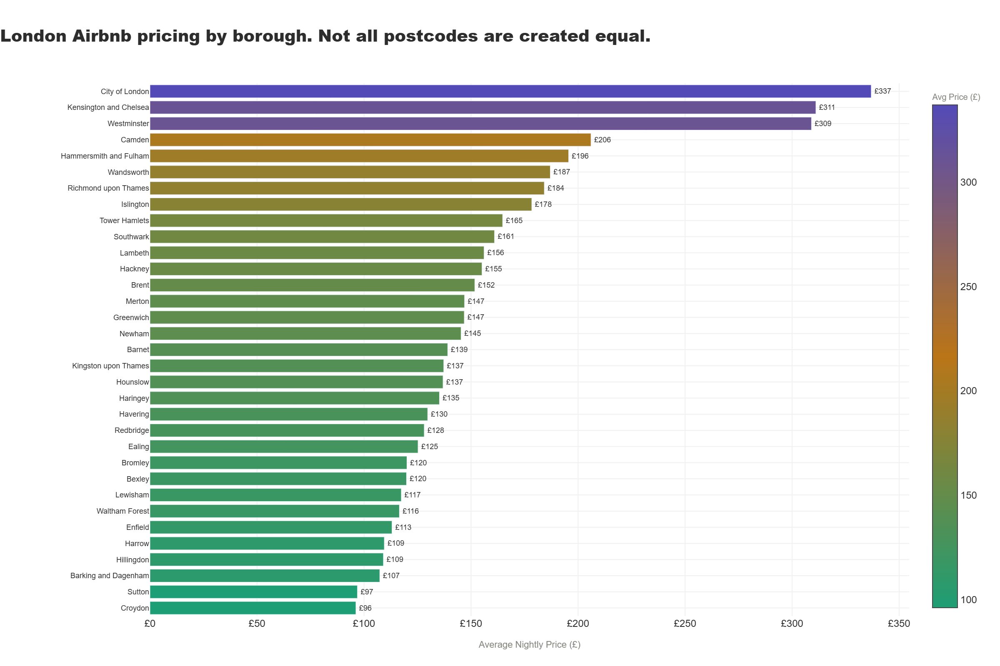

# The Christmas Premium
*London Airbnb pricing analysis across 33 boroughs, what the data 
reveals about the world's most visited festive city and exactly how 
much the magic costs.*

---

## The Hook

London at Christmas is not a marketing campaign. It is a cultural 
export. The lights on Oxford Street. The markets in Hyde Park and 
South Bank. The ice rinks outside Somerset House and the Natural 
History Museum. Every year, millions of people from every corner 
of the world put London in December on their list and the city's 
short term rental market prices accordingly.

This project uses Inside Airbnb listing data across London's 33 
boroughs alongside Google Trends search interest for "London 
Christmas" to answer the question every traveller has asked and 
every hospitality brand wants to know: how much does the Christmas 
premium actually cost, where does it land hardest, and which 
neighbourhoods are quietly extracting the most value from the 
world's collective festive imagination?

The data does not care about the fairy lights. But it noticed them.

---

## The Tableau Dashboard

**[View the full interactive dashboard on Tableau Public](https://public.tableau.com/app/profile/trupthi.raj/viz/TheChristmasProject/TheChristmasPremium)**

The dashboard combines four views into one interactive experience:
a borough price map of London, the Christmas search signal build up 
from 2020 to 2025, the host type pricing analysis, and the scarcity 
premium scatter. Every chart is interactive — hover for borough 
details, filter by price tier, explore the seasonal pattern year 
by year.

---

## The Borough Price Map



Not all London postcodes are created equal. Westminster averages 
£309 per night. Croydon averages £96. These are not two different 
cities — they are two stops on the same tube line. The price 
difference between them is the cost of proximity to the fairy 
lights, the markets, the ice rinks, and the particular version 
of London that the world flies in to experience every December.

---

## What Makes This Different

- Which London boroughs combine high pricing with low availability — the true measure of Christmas demand?
- Does Google Trends search interest for "London Christmas" predict when hosts should be maximising their pricing?
- Do professional operators charge more than personal hosts — or does the personal touch command its own premium?
- Which boroughs are expensive but empty versus expensive and fully booked?
- How has Christmas demand for London grown year on year since 2020?

---

## Key Findings

1. **Westminster averages £309 per night. Croydon averages £96.** The Christmas premium is not spread equally across London. It is hyperlocal, postcode by postcode, and the data maps every pound of it.

2. **The world starts thinking about Christmas in London in August.** Google Trends search interest for "London Christmas" sits at 6.3 in August, climbs to 19.0 in October, 42.8 in November, and peaks at 60.0 on average in December. December 2025 hit the maximum score of 100. Demand is growing every single year.

3. **Empire Builders charge £264 on average. Solo Hosts charge £161.** Professional operators with 20+ listings price significantly higher than personal hosts. But Solo Hosts have the lowest availability at 200 days per year, meaning their listings sell out fastest despite costing less.

4. **City of London is expensive and empty.** At £337 average price and 258 days average availability, the Square Mile is the most expensive borough with the most available listings. The Christmas leisure traveller is not choosing the financial district. The data confirms it.

5. **Hackney is scarcer than Camden despite being cheaper.** At 195 days average availability, Hackney listings are harder to book than any other non-premium borough. Demand has caught up with supply in ways the pricing has not yet reflected.

---

## What A Hospitality Brand Should Do With This

**Hotel and Short Term Rental Groups —** The scarcity premium analysis identifies boroughs where demand structurally exceeds supply. Westminster and Kensington and Chelsea combine high pricing with relatively low availability — meaning expensive listings in these boroughs are actually being booked. City of London combines high pricing with high availability — meaning the premium is aspirational rather than validated by the market. These are two very different investment profiles wearing similar price tags.

**Pricing and Revenue Teams —** The Google Trends data shows that Christmas demand starts building in August and accelerates through September and October. Hosts and operators who wait until November to adjust their December pricing are leaving revenue on the table. The search intent is there months before the booking window opens.

**Airbnb Hosts —** Solo Hosts charge less and sell out faster. Empire Builders charge more and have more availability. The data suggests personal listings are underpriced relative to their demand. A Solo Host in Westminster charging £161 on average in a borough where the market average is £309 is not being strategic. The Christmas traveller has already decided they want to be in London. The question is whether the pricing reflects that.

**Travel and Tourism Brands —** December 2025 hit a Google Trends score of 100 for "London Christmas" — the highest ever recorded. The world is not getting less interested in spending Christmas in London. It is getting more interested, earlier, with more intention. Any brand positioning itself as a London Christmas experience has a growing and increasingly early audience to reach.

---

## Project Structure

```
The-Christmas-Premium/
│
├── the_christmas_premium.ipynb         # Full annotated Python notebook
├── Dashboard_Christmas.twbx            # Tableau packaged workbook
├── Dashboards.twb                      # Tableau workbook file
│
├── chart1_neighbourhood_prices         # Average price by London borough
├── chart2_room_type_premium            # Entire home vs private room pricing
├── chart3_christmas_signal             # Google Trends seasonal build up
├── chart4_scarcity_premium             # Price vs availability scatter
└── chart5_host_types                   # Solo host vs empire builder analysis
│
│   All Python charts saved as .png and interactive .html
```
---

## Tech Stack

| Tool | Purpose |
|---|---|
| Python | Data cleaning and analysis |
| pandas + NumPy | Data manipulation |
| Plotly | Interactive Python charts |
| Tableau Public | Interactive dashboard and borough map |
| Inside Airbnb | London listings data |
| Google Trends | Christmas search interest 2020-2025 |

---

## Data Sources

**[Inside Airbnb London Listings](https://insideairbnb.com/get-the-data/)**
96,871 listings scraped from Airbnb in September 2025, cleaned to 
60,777 active listings across 33 London boroughs. Includes pricing, 
room type, host listing count, availability and neighbourhood. 
Chosen because it captures the actual short term rental landscape 
of London at a moment when Christmas pricing would be starting to 
build — September is when hosts begin adjusting their December rates.

**Google Trends — "London Christmas" 2020-2025**
Monthly search interest index for "London Christmas" worldwide from 
January 2020 to December 2025. Chosen to show the demand signal 
that precedes Airbnb bookings — search interest is the earliest 
measurable indicator of Christmas travel intent and the data shows 
it building as early as August each year.

---

## What I Learned

The most surprising finding was not in the pricing data but in the 
host type analysis. The assumption going in was that personal, 
character-filled listings would command a premium over professionally 
managed ones. The data said the opposite. Empire Builders with 20 
or more listings charge £264 on average. Solo Hosts charge £161. 
The professional operator has figured out the pricing optimisation. 
The personal host has not, or has decided not to try. But the 
availability data tells the other half of the story — Solo Host 
listings sell out faster despite costing less. The Christmas 
traveller is choosing the personal listing and booking it out. 
The data caught both sides of that tension.

The City of London finding was the most commercially useful. 
The most expensive borough in the dataset with the highest average 
availability. An expensive listing that nobody is booking is not 
a premium product. It is an overpriced one. The Christmas leisure 
traveller is not choosing the Square Mile. They are choosing 
Westminster, Kensington, Camden. The financial district's Airbnb 
market exists for a completely different type of visitor and the 
Christmas season does not change that.

Building the Tableau dashboard alongside the Python analysis was 
the most technically satisfying part of this project. Python 
cleaned the data and built the analytical foundation. Tableau 
built the map and made the borough-level story interactive in a 
way that static charts cannot replicate. The combination of both 
tools in one project reflects how real analytics teams actually 
work — Python for the analysis, Tableau for the communication.

---

## About

**Trupthi Raj** — Data Analyst with strong opinions about London 
boroughs, Christmas markets, and the gap between where people want 
to stay and what they are willing to pay for it.

[GitHub](https://github.com/trupthiraj) ·
[Tableau](https://public.tableau.com/app/profile/trupthi.raj/vizzes)
